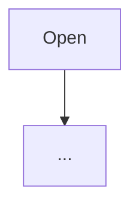

# PRD template

Post as the body file for `transition ... --kind prd`. The tool adds the marker, the
revision header and the sign-off footer; don't write those. Say what and why, never how.

```markdown
## Problem
Who hurts, when, and what they do today.

## Users and scenarios
Two or three concrete walk-throughs ("Maya wakes at 7 and ...").

## Scope
- In: ...
## Non-goals
- Out: ...

## App flow


## Screens
ASCII mockup per new screen; a committed Textual SVG screenshot (raw URL) for existing ones.

## Architecture proposal
Components touched and new, in terms of the repo's modules (`src/twiddle/...`), and the
system dependencies (services, protocols, packages). A Mermaid diagram if it helps. Not an
implementation plan.

## Safety class
Read-only or writing (per `CLAUDE.md`'s table); `--dry-run` needed?; journalled to
`logs/interventions.jsonl`?; what could change a real speaker and how it is restored.

## Acceptance criteria
1. Numbered, observable, testable.

## Open questions
Each with the default assumed if unanswered.
```
