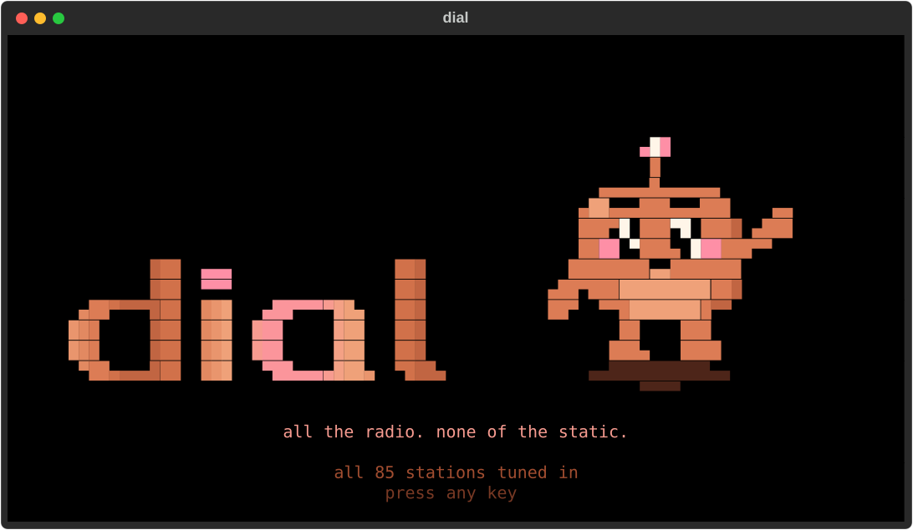

# twiddle

> *all the radio. none of the static.*



**twiddle is a terminal radio and gig-finder for people who still turn
knobs.** It shows what every station is playing right now, which bands are
on at your local venues tonight (and who they actually are), and a
visualizer that dances along. It plays on your Mac, your Bluetooth
headphones, or your Sonos.

It's named after its mascot, Twiddle, a small clay-coloured critter who was
born in the static between two AM stations and eats it. Meet him (and the
rest of the cast, eventually) in [CHARACTERS.md](CHARACTERS.md).

## What's in it

| | |
|---|---|
| **`dial`** | Every station's now-playing on one screen: 85 stations, from college radio (KALX, KEXP, WFMU) to SomaFM, NTS, FIP and Japanese city pop. You get album covers, who the artist is, and what the station just played. Press `enter` to listen and `t` to filter by genre. |
| **`scene`** | Upcoming shows at about forty Bay Area venues, from 924 Gilman to the Fillmore. For each band it works out who they are (with a badge that says how sure it is), then plays their Bandcamp tracks or Spotify so you can decide whether to go. |
| **`v`** | In either app, turns the whole window into a music visualizer: spectrum, oscilloscope, Doom fire, a starfield, Julia-set fractals, lasers, dancing cartoon pets, and Twiddle himself. |
| **Sonos** | Control your speakers by room name (`twiddle vol ++3`, `twiddle tune kexp --room kitchen`), and play Spotify through a local relay instead of Sonos's cloud. If your speakers drop out, there are diagnostics that measure whether it's the speaker or the setup. |

No Sonos? `dial` and `scene` work without one: they play through your Mac's
own speakers or your headphones.

## Getting started

You need a Mac with [Homebrew](https://brew.sh). Linux works for most of it,
but it's less tested.

```bash
brew install uv ffmpeg librespot     # librespot only if you want Spotify
git clone https://github.com/jeromebanks/twiddle.git
cd twiddle
uv sync
uv run twiddle dial                  # radio
uv run twiddle scene build           # compile the local shows dataset (then: scene schedule)
uv run twiddle scene                 # local shows (reads it; works offline)
```

[docs/QUICKSTART.md](docs/QUICKSTART.md) walks through everything in about
ten minutes: the short shell names (`dial`, `shows`, `np`, `kexp` …), your
own Spotify app (you need one to play from Spotify; radio and Bandcamp don't),
and troubleshooting.

## Things to know

- **It started as one household's project.** The defaults show it: Bay Area
  venues, and a Sonos room called `roam` in some examples. Your venues go in
  `~/.config/twiddle/scene.toml` ([docs/SCENE.md](docs/SCENE.md) → *Your
  venues*), and `twiddle rooms` lists your own speakers.
- **Anything that changes a speaker says so.** In `--help`, every command
  that changes what a speaker is doing is marked `(WRITES)`. They all take
  `--dry-run`, and every one is logged to `logs/interventions.jsonl` on your
  machine.
- **Stations and venues are other people's websites.** twiddle reads public
  now-playing feeds and venue listings, throttles its requests, and caches the
  results. When a site changes its layout, a source can break until someone
  fixes it.
- **The visualizer shows the stream, not the speaker.** It decodes its own
  copy of what's playing, so it can't prove that sound actually came out of a
  speaker. That lesson comes up again and again in the Sonos docs.

## Docs

| | |
|---|---|
| [docs/QUICKSTART.md](docs/QUICKSTART.md) | setting up on your own Mac, step by step |
| [docs/GUIDE.md](docs/GUIDE.md) | every command; the Sonos tools and how they measure (and the traps that fooled them first) |
| [docs/SCENE.md](docs/SCENE.md) | the `scene` app: keys, band identity, venue sources, extending it |
| [docs/SPOTIFY.md](docs/SPOTIFY.md) | playing Spotify on Sonos through a local relay, and what that took |
| [CHARACTERS.md](CHARACTERS.md) | Twiddle, and the cast to come |
| [CLAUDE.md](CLAUDE.md) | working in the code (written for Claude Code, useful for humans too) |

## Contributing

`uv run pytest` runs about 1150 tests in a minute. None of them touch the
network, a speaker or Spotify. Adding a radio station, a venue or a visualizer
each has a written recipe in `.claude/skills/`. Claude Code picks those up
automatically, and a person can simply read them.

## License

MIT, see [LICENSE](LICENSE). Station streams, now-playing data, venue
listings, artwork and artist bios belong to their owners; twiddle only
points at them.
