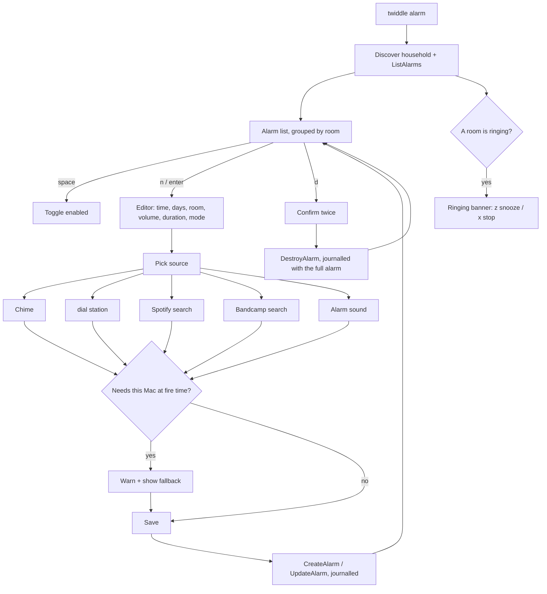
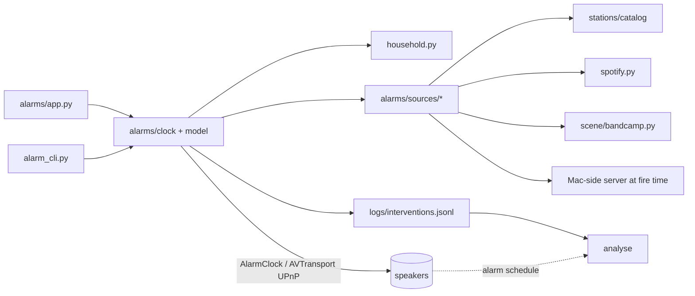

# PRD: Sonos Alarm Manager (#12)

Approved revision 1, signed off by @jeromebanks on 2026-10-02 ([PRD](https://github.com/jeromebanks/twiddle/issues/12#issuecomment-5961388658), [sign-off](https://github.com/jeromebanks/twiddle/issues/12#issuecomment-5961954061), [approval record](https://github.com/jeromebanks/twiddle/issues/12#issuecomment-5962339991)). The text below is rev 1 exactly as approved. The addendum at the end was requested in the sign-off.

## Problem

Setting a Sonos alarm today means opening the Sonos app on a phone. That's slow, and the app can't pick from the twiddle catalog of stations that `dial` plays, Bandcamp, or anything not linked to the Sonos account. Twiddle can see and control every speaker already, but it can't see alarms. Nothing in `src/twiddle/` uses the speakers' `AlarmClock` service.

The household already has alarms. A read-only `ListAlarms` on 2026-10-02 returned **10 alarms on the Roam pair, 3 of them enabled**. They use a mix of sources:
- Sonos's own Spotify link (`x-rincon-cpcontainer:...spotify...?sid=12`, playlists)
- iHeart and Sonos Radio streams
- the Sonos chime (no program URI)

One alarm's `RoomUUID` is the Roam pair's **bonded follower** (the R Roam), not its coordinator. So the manager has to read and keep alarms it didn't create, including oddly-targeted ones, as well as make new ones.

There's a second, quieter problem. An alarm going off is a transport write that nobody journalled. `analyse` doesn't discount it, so every morning alarm can look like a fault in the dropout evidence.

## Users and scenarios

- **Weekday radio.** At night, Jerome opens `twiddle alarm`, sees their existing radio alarm, and adds a 07:15 Mon–Fri alarm on the Roam that plays KALX from the dial catalog at volume 20 for 1 hour. The next morning the Roam plays KALX by itself, whether or not the Mac is awake.
- **A record you found last night.** In `scene`, Jerome heard a Bandcamp track by a band playing tonight. In `twiddle alarm` they choose Bandcamp → search the band → pick the track, and set it for Saturday 09:00. The editor says plainly that this source needs this Mac awake at 09:00, and what plays if it isn't.
- **It's ringing.** The Roam's alarm is going off. `twiddle alarm` shows a "ringing" banner for that room: `z` snoozes it for 10 minutes and `x` stops it.
- **An agent or a script.** `twiddle alarm list --json` gives every alarm with its room *name*, its days and its source title, read-only, and `twiddle alarm add ... --dry-run` prints the alarm it would create without creating it.

## Scope

- In: a new `twiddle alarm` Textual TUI, its own command next to `dial` and `scene` (that's how I read "standalone"; see open question 1).
- In: list **all** alarms in the household, grouped by room. Show time, days, enabled, source title (from the alarm's own metadata) and volume. Show alarms whose room is a bonded follower or a vanished speaker, labelled as such, rather than hiding them.
- In: create, edit, delete, and enable/disable. Everything the speaker's `AlarmClock` API exposes is editable: start time, recurrence (once / daily / weekdays / weekends / any set of days), duration (the auto-stop), volume, play mode (normal / shuffle / repeat / shuffle-repeat), "include grouped rooms", room, and source.
- In: what the speakers actually expose (read from `/xml/AlarmClock1.xml` and `/xml/AVTransport1.xml` on the Roam, 2026-10-02):
  - `AlarmClock`: `ListAlarms` (with `CurrentAlarmListVersion`), `CreateAlarm`, `UpdateAlarm` and `DestroyAlarm`, whose fields are `StartLocalTime`, `Duration`, `Recurrence`, `Enabled`, `RoomUUID`, `ProgramURI`, `ProgramMetaData`, `PlayMode`, `Volume` and `IncludeLinkedZones`. Also the household-wide `GetTimeNow`/`GetTimeZone`/`GetFormat`, which are read to show the next fire in the household's own time and format.
  - `AVTransport`: `GetRunningAlarmProperties` and the `AlarmRunning`/`SnoozeRunning` state for "is it ringing", plus `SnoozeAlarm`, `Stop` and `RunAlarm`. `RunAlarm` is offered as **"try it now"**, so you can hear an alarm before trusting it.
- In: **sources behind one interface**, so a new provider is one new module that reports its own constraints. Version 1 ships:
  - **Sonos chime**: the speaker's built-in alarm sound, which needs nothing else.
  - **dial station**: any station in `stations/catalog/`. The speaker fetches the stream itself, so no Mac is needed.
  - **Spotify**: a track, album or playlist through Sonos's own Spotify account link. The existing alarms show it's linked, and it needs no Mac. See open question 3 about the relay.
  - **Bandcamp**: a track found the way `scene` finds them. Bandcamp stream URLs expire in about a day, so this source needs this Mac at fire time. It's labelled that way.
  - **Alarm sounds**: a small set of standard sounds (e.g. classic bell, digital beep, gentle rise, birdsong, chimes). Sonos has only the one built-in chime, so these are served from this Mac and labelled the same way.
  - **Keep as is**: an existing alarm's source that twiddle doesn't recognise (TuneIn, iHeart, Sonos Radio, ...) is preserved untouched when other fields are edited.
- In: each source reports whether it **needs this Mac at fire time**. For those that do, the editor says what happens if the Mac is asleep, and the list marks the alarm.
- In: a **ringing alarm**. Detect it (the speaker reports a running alarm), then stop it or snooze it (the speaker's own snooze, with a chosen duration).
- In: a CLI next to the TUI, matching the repo's habit (`--json`, `ok`/`error` envelope): `alarm list` (read-only), plus `alarm add/edit/rm/enable/disable/stop/snooze`, which are writing commands with `--dry-run`.
- In: `analyse` stops counting alarm fires as faults. Alarms twiddle sets and alarms set in the Sonos app are both covered.

## Non-goals

- Out: Sonos's cloud Control API and S2-only cloud features. Only the speaker's local UPnP API is used, as everywhere else in twiddle.
- Out: changing household-wide clock settings (`SetTimeNow`, `SetTimeZone`, `SetTimeServer`, `SetFormat`, `SetDailyIndexRefreshTime`). They affect every speaker and aren't per-alarm, so they are read only.
- Out: sleep timers. `sleep` and `comedy sleep` already do those.
- Out: a Mac-side scheduler that plays at a time *instead of* a Sonos alarm. The speaker owns the schedule, so alarms survive the Mac being off.
- Out: playing an alarm through the Spotify relay. See open question 3.
- Out: implementing other providers (podcasts, Apple Music, local files) in v1. The interface has to admit them, and a podcast episode is the test case in the acceptance criteria.

## App flow



## Screens

All new, so ASCII mockups.

Main list:

```
 twiddle alarm                                         Fri 2 Oct  21:14
 ┌ Sonos Roam ───────────────────────────────────────────────────────────┐
 │ ● 06:45  Mon–Fri           KALX 90.7 Berkeley       vol 20  1h        │
 │ ● 09:30  Sat Sun           Morning Jazz playlist    vol 25  2h  shuf  │
 │ ● 08:00  Sat               Bandcamp · Some Band ⌁   vol 30  1h        │
 │ ○ 07:00  Tue Wed           Sonos chime              vol 40  2h        │
 │ ○ 18:00  once              Classic bell ⌁           vol 35  0:15      │
 │   …                                                                   │
 ├ Sonos Roam (R) — bonded follower, alarm goes to its pair ─────────────┤
 │ ○ 17:00  Fri               Friday playlist          vol 50  2h        │
 ├ Living Room ──────────────────────────────────────────────────────────┤
 │   (no alarms)                                                         │
 └───────────────────────────────────────────────────────────────────────┘
  ⌁ = needs this Mac at fire time     next: Sat 08:00 Some Band
  n new  enter edit  space on/off  t try now  d delete  r refresh  q quit
```

Editor:

```
 ┌ New alarm ────────────────────────────────────────────────┐
 │ Time      [07:15]                                         │
 │ Days      [M] [T] [W] [T] [F] [ ] [ ]   once/daily/wkdy…  │
 │ Room      Sonos Roam ▾       [ ] include grouped rooms    │
 │ Source    dial · KALX 90.7 Berkeley           (change…)   │
 │ Volume    ▮▮▮▮▯▯▯▯▯▯ 20                                    │
 │ Stop after 1:00   Mode  normal ▾                          │
 │                                                           │
 │ ✓ Plays without this Mac.                                 │
 └───────────────────────────── [Save]  [Cancel] ────────────┘
```

When a source needs the Mac, the last line becomes: `⌁ Needs this Mac awake at 07:15. If it isn't: <fallback>.`

(Times and titles above are illustrative.)

Ringing banner:

```
 ⏰ Sonos Roam is ringing: KALX 90.7 since 06:45    z snooze 10m   x stop
```

## Architecture proposal

- **New `src/twiddle/alarms/`** (domain, no UI):
  - `model`: an `Alarm` that round-trips every field the speaker returns, including program metadata it doesn't understand. Recurrence is parsed to and from `ONCE` / `DAILY` / `WEEKDAYS` / `WEEKENDS` / `ON_<days>`.
  - `clock`: list, create, update, destroy and enable through the `AlarmClock` service; running-alarm, stop and snooze through `AVTransport`.
  - `sources/`: one module per provider (`chime`, `station`, `spotify`, `bandcamp`, `sound`), plus a registry. Each one can search or list, build the URI and metadata, describe itself, and say whether it needs this Mac at fire time and what the fallback is.
- **New `src/twiddle/alarms/app.py`** (Textual UI only) and **`alarm_cli.py`**, registered in `cli.py`.
- **Reused:** `household.py` maps room names to UUIDs, coordinators and bonded followers. `stations/` provides the catalog. `scene/bandcamp.py` does search and fresh stream URLs. `spotify.py` handles search and maps to Sonos Spotify URIs. `play.py` provides DIDL, the journal and the HTTP serving. `topology.py` handles bonded followers and vanished devices.
- **Mac-dependent sources** (Bandcamp, alarm sounds) need something on this Mac reachable over HTTP at fire time. That fits the existing launchd pattern (`daemon.py`, `supervisor.py`). Its form is the planner's call. Whatever it is must journal what it serves.
- **`report.py` / `analyse`:** alarm fire times, alarm stops and snoozes are discounted like journalled writes.
- **Dependencies:** `soco` (already present) and the speaker's local UPnP `AlarmClock` / `AVTransport` services. No new packages are expected beyond licence-clean audio files for the sounds.



## Safety class

- **Read-only:** `twiddle alarm list`, opening the TUI, browsing, and searching sources. These touch no speaker transport or alarm. `ListAlarms` and `GetRunningAlarmProperties` are reads.
- **Writing:** create, edit, delete, enable/disable, try-now (`RunAlarm`), stop and snooze. An alarm is also a **deferred transport + volume write**: it changes what a real speaker does at a future time, so it belongs with the writing rows of `CLAUDE.md`'s table, and that table gets a new row.
- **`--dry-run`** on every writing CLI verb: it resolves the room, the source URI and the recurrence, and prints the alarm it would write.
- **Journalled** to `logs/interventions.jsonl`: every create/update/delete/enable/stop/snooze, with the full alarm before and after, so a deleted or clobbered alarm, including one made in the Sonos app, can be recreated from the journal.
- **The fire itself:** `analyse` must discount events around each enabled alarm's fire time (and around its `duration` stop), whoever set it.
- **Never surprise:** deleting asks twice. Editing an alarm twiddle doesn't recognise leaves its source untouched. If `ListAlarms` reports a newer list version than the one being edited (someone changed it in the Sonos app), the edit is refused and the list refreshed, not overwritten.
- **Testing:** tests use recorded `ListAlarms` XML and never touch a speaker.

## Acceptance criteria

1. `twiddle alarm list` prints every alarm in the household with room name, time, days, enabled, volume, duration, play mode and source title. A test feeds it a recorded `ListAlarms` response, with Sonos Spotify, iHeart, Sonos Radio and chime alarms and one aimed at a bonded follower, and every alarm comes out correctly.
2. `twiddle alarm list --json` returns the same in the repo's `ok`/`error` envelope, and it is read-only: no journal entry, no `AlarmClock` or `AVTransport` write.
3. An alarm whose `RoomUUID` is a bonded follower or a speaker no longer present is listed and labelled, not hidden or crashed on.
4. The TUI can create an alarm with each recurrence form (once, daily, weekdays, weekends, an arbitrary set of days), and `ListAlarms` reads it back identically.
5. Every field `AlarmClock` exposes is editable from the TUI and the CLI: time, recurrence, duration, volume, play mode, include-grouped-rooms, room, enabled and source.
6. Editing any field of an alarm with an unrecognised source (e.g. an existing iHeart alarm) leaves its `ProgramURI` and `ProgramMetaData` byte-for-byte unchanged.
7. Enable/disable is one key in the TUI, and the CLI has `alarm enable|disable`.
8. Delete asks twice, and journals the full alarm. Recreating that alarm from its journal entry is possible: a test shows it.
*Criteria 9–11 and 15 need a real speaker, so they are **manual or demo checks**, not automated tests (see 21).*

9. A dial-catalog station alarm plays that station's stream on the speaker with this Mac off the network.
10. A Spotify alarm (track, album or playlist) plays through Sonos's own Spotify with this Mac off the network.
11. A Bandcamp track and each standard alarm sound can be chosen. The editor and list mark them `⌁`, needing this Mac. With the Mac unavailable at fire time, the room still makes a sound (the stated fallback), never silence. Sonos falling back to its chime when the source can't be reached is *assumed, not yet verified*: it gets confirmed on a real speaker before planning (open question 2). If it doesn't hold, the criterion is restated.
12. At least 4 standard alarm sounds are offered, with their licence recorded in the repo.
13. Adding a new provider is one new module in `alarms/sources/` plus a registry entry, without editing the UI or CLI. A test registers a fake provider (e.g. a podcast episode) and it appears in the picker.
14. "Try it now" (`t` / `alarm try`) fires the selected alarm immediately through the speaker's `RunAlarm`, journalled.
15. While an alarm is going off, the TUI shows which room and alarm. `x` stops it, `z` snoozes it for a chosen duration through the speaker's own snooze, and the CLI has `alarm stop|snooze --room`.
16. Every writing CLI verb accepts `--dry-run`, prints what it would do, and writes nothing to the speaker or the journal.
17. Every alarm write, try-now, stop and snooze appears in `logs/interventions.jsonl`.
18. `analyse` does not count transport or volume changes within the discount window of an enabled alarm's fire time, or of its duration-stop, as faults. A test covers an alarm set in the Sonos app (not journalled by twiddle).
19. If the alarm list changed on the speaker since the editor opened, saving refuses and refreshes instead of overwriting.
20. `CLAUDE.md`'s read-only vs writing table, its layout table and `docs/GUIDE.md` describe `twiddle alarm`.
21. No test touches the network, a speaker or Spotify.

## Open questions

1. **"Standalone"**: does that mean its own `twiddle alarm` command in this repo (sharing `household`, `stations`, Spotify, Bandcamp), or a separate package or repo? *If you don't say, I'll assume `twiddle alarm` in this repo, like `dial` and `scene`.*
2. **Mac-dependent sources**: Bandcamp tracks and any sound beyond the one built-in Sonos chime only play if this Mac is awake and serving at fire time. Is that acceptable for an alarm, as long as it's clearly labelled and falls back to the chime? (That the speaker falls back to its chime by itself when a source is unreachable is my assumption; I'll test it on the Roam before planning.) Or should v1 be only sources that work with the Mac off (chime, dial stations, Sonos Spotify)? *If you don't say, I'll assume they're in, labelled, with the chime as fallback.*
3. **Spotify path**: twiddle's own Spotify playback goes through the relay because Sonos's Spotify handoff was the worst dropout trigger measured (`docs/SPOTIFY.md`). Alarms can only use Sonos's own Spotify link, which your existing alarms already use. Is that acceptable for alarms? *If you don't say, I'll assume yes: Sonos-native Spotify for alarms, and no relay.*
4. **Standard sounds**: any preference (classic bell, digital beep, gentle ramp, nature, ...)? Is generating them from `tone.py` acceptable, versus licence-clean recordings? *If you don't say, I'll assume a mix of generated tones and CC0 recordings, at least 4.*
5. **Snooze length**: Sonos's app uses a fixed snooze. *If you don't say, I'll assume 10 minutes by default, changeable per press (5/10/15/30).*
6. **Discounting alarms in `analyse`**: this changes how existing evidence is scored, because Sonos-app alarms have been firing un-discounted. Should it be in this issue, or split into its own? *If you don't say, I'll assume it stays in this issue.*

---

## Addendum (requested at approval)

From [the sign-off comment](https://github.com/jeromebanks/twiddle/issues/12#issuecomment-5961954061): *"If the tui running when an alarm goes off, it should display an ASCII graphic of an alarm ringing in the screen which has off or snooze."*

22. If `twiddle alarm` is open when an alarm goes off, it shows a full-screen ASCII graphic of a ringing alarm clock, with **off** (`x`) and **snooze** (`z`). This replaces the one-line ringing banner in criterion 15. The CLI `alarm stop|snooze` is unchanged.

Mockup (illustrative):

```
                      \  _______  /
                    ── (  .-""-.  ) ──
                      /  /  12   \  \
                        |    |    |
                        | 9  o──3 |        ⏰  Sonos Roam is ringing
                        |         |        KALX 90.7 Berkeley · since 06:45
                         \   6   /
                          '-...-'
                          /     \
                     ~~~~~~~~~~~~~~~~~
                   [ x  off ]   [ z  snooze 10m ▾ ]
```

## Resolved open questions

None of the questions were answered, so the stated defaults stand:

1. `twiddle alarm` is a command in this repo, like `dial` and `scene`.
2. Mac-dependent sources (Bandcamp, alarm sounds) are in. They're labelled `⌁` and fall back to the chime. **This is still unverified:** before planning, check on the real Roam that the speaker falls back to its chime when a source is unreachable. That check writes to a speaker, so it needs the maintainer's go-ahead.
3. Alarms use Sonos-native Spotify, not the relay.
4. Sounds are a mix of generated tones and CC0 recordings, at least 4.
5. Snooze is 10 minutes by default, changeable per press (5/10/15/30).
6. `analyse` discounting stays in this issue.
