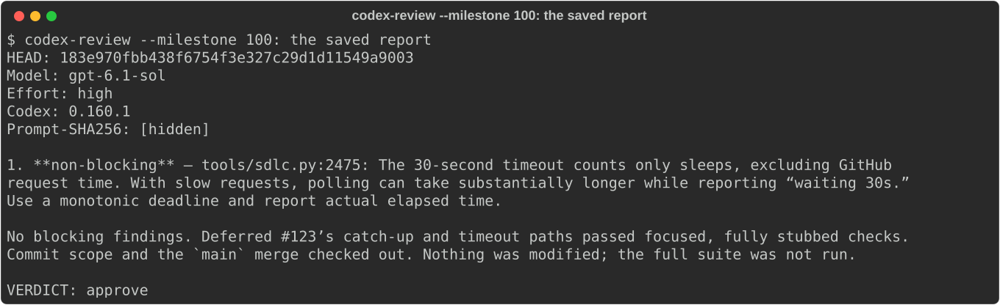
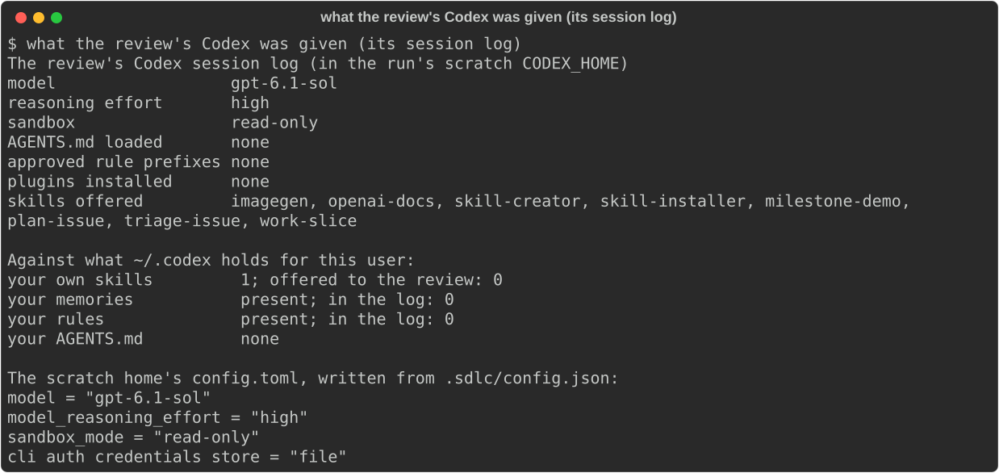
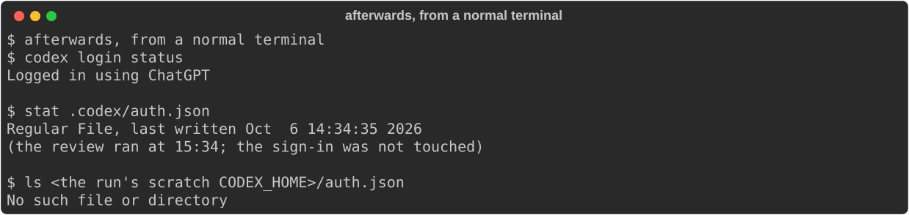
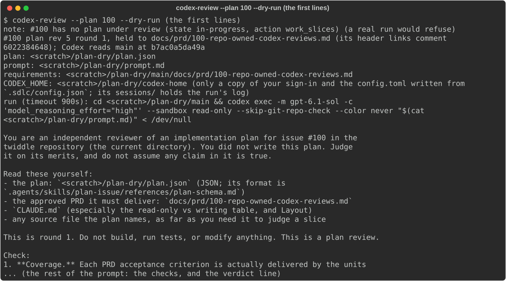
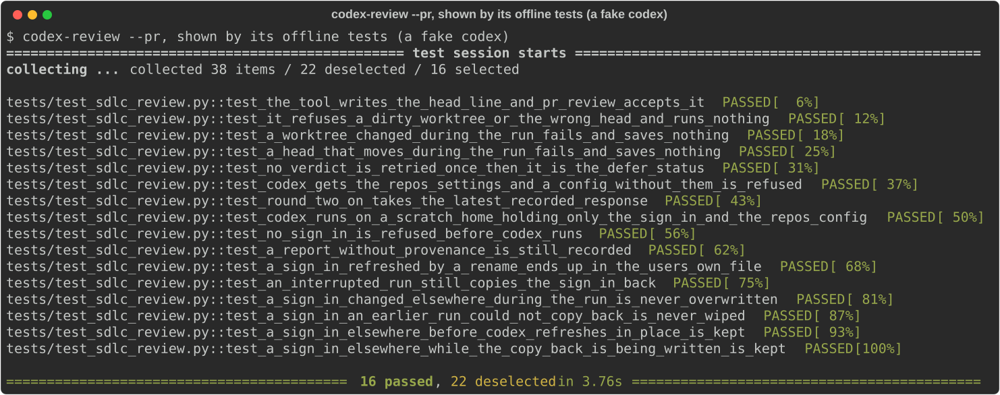
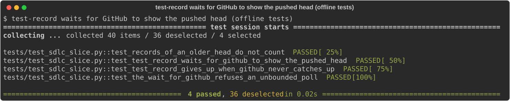
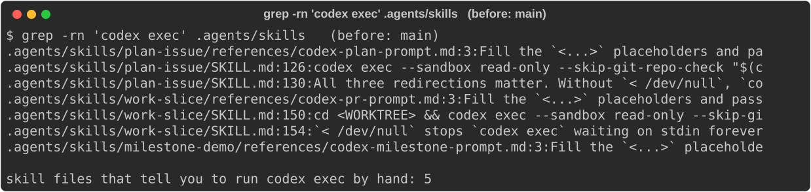

# #100 M1: The tool runs every Codex review, on its own settings

Demo of milestone M1 of epic #100, shown from `epic/100` at `183e970` (after `sync 100` brought
`main` in and the full suite passed on that head). `main` is the "before".

## What was built

| Slice | What it did | PR |
|---|---|---|
| #123 `T1` (routine) | `test-record` waits up to about 30 s for GitHub to show a just-pushed head, instead of failing with "HEAD is not PR's head". `work-slice` §6 gains a self-review checklist to work through before opening a PR. | #130 |
| #124 `T2` | `codex-review --pr`: the tool fills the prompt, checks the worktree and its HEAD before and after the run, writes the `HEAD:` line itself, retries once when there's no verdict, and takes the model, effort, sandbox and timeout from `.sdlc/config.json`. All the review logic lives in `tools/codex_review.py`. | #133 |
| #125 `T3` | Every review runs Codex under a scratch `CODEX_HOME` holding only the sign-in and a `config.toml` written from the repo's settings. The report records the model, effort, Codex version and a hash of the prompt, and the round comments show them. | #137 |
| #126 `T4` | `codex-review --plan N` and `--milestone N` use the same runner. `plan-issue`, `work-slice` and `milestone-demo` go through the tool, and a guide test fails if a skill tells anyone to run `codex exec` by hand. | #141 |

## The steps, as run

All read-only. Nothing in this milestone touches a speaker or Spotify, so nothing needed a person
to run it.

### 1. The milestone's own review, run by the tool

`uv run python tools/sdlc.py codex-review --milestone 100`, from `.worktrees/epic-100`. This was
the real review of this milestone, owed because T1 was a routine slice reviewed with its milestone.
The tool wrote the milestone brief and one brief per slice, listed T1 as owed its first review,
ran Codex under the isolated home, and stamped the report:

(`demo_shot` masks the prompt hash as it draws: it looks like an identifier.)

`ship-review 100` recorded the round on the epic, and the comment carries the same provenance.
Codex approved, with one non-blocking finding: the 30-second wait counts sleeps, not wall time.
That's already tech debt #131.

### 2. What that Codex session was given

This was read from the run's own session log in the scratch `CODEX_HOME`, summarised by a
small script. The raw log isn't published.

- The pinned model and effort (`gpt-6.1-sol`, `high`) and the read-only sandbox are in force.
- No `AGENTS.md`, no approved rule prefixes, no installed plugins. The user's own skill, memories and rules in
  `~/.codex` appear nowhere in the log.
- The skills offered are Codex's own built-ins (`imagegen`, `openai-docs`, `skill-creator`,
  `skill-installer`) and the repo's own `.agents/skills`. SDLC.md already says that
  isolation can't keep out what the repo itself holds. Codex also lists curated plugins as
  "available but not installed". It also fills the scratch home with its own caches
  (`skills/.system`, `plugins/cache`). None of that comes from the user's `~/.codex`.

### 3. The sign-in afterwards

The tool gives Codex a private copy of the sign-in. Nothing was refreshed during this run,
so the user's file wasn't touched, and the copy was removed afterwards. Copy-back after a
refresh, and every way a run can end, are covered by T3's offline tests (step 5).

### 4. The plan review, as a dry run

`codex-review --plan 100 --dry-run` prints the prompt and the exact command, and runs nothing.
The capture shows its first lines, with the scratch path shortened to `<scratch>`. Epic #100 has
no plan under review now, so the dry run says a real run would refuse. It still resolves the
approved PRD from `main` by the comment its header links, and it removed the scratch checkout of `main` it made.

### 5. PR mode, through its offline tests

No slice PR is open at demo time, so `--pr` is shown by its tests against a fake `codex`.
They cover the stamped HEAD, refusing a dirty worktree or the wrong head, a HEAD that moves
mid-run, the one retry, the repo's settings, round 2+ responses, the scratch home and every
sign-in path.

### 6. test-record's wait, through its offline tests

### Before and after: no skill runs Codex by hand

| Before (`main`) | After (`epic/100`) |
|---|---|
|  |  |

## What changed from the plan

- **The sign-in is a private copy, not a link.** T3's brief proposed linking `auth.json`. Codex refreshes it in place (open, truncate,
  write), so a link would let a refresh write straight into the user's file with no check. The tool gives Codex a 0600 copy instead.
  After the run, it writes the copy back atomically, and only when the copy changed, is a whole sign-in, and the user's file
  is unchanged since the run started. SDLC.md documents this.
- Otherwise built as planned.

## Known gaps

- #131: test-record's GitHub wait counts sleeps, not wall time (also Codex's one finding in this review).
- #134: `codex-review` should refuse a round that can't be recorded (rounds spent, head already approved).
- #139: `codex-review --dry-run` prints a `codex` command that isn't isolated if someone copies and runs it by hand.
- #143: a test that `codex-review --plan`'s `docs/prd` path is readable from its checkout of `main`.
- The review eval is M2.
