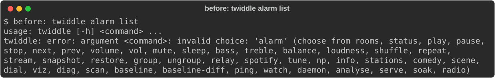
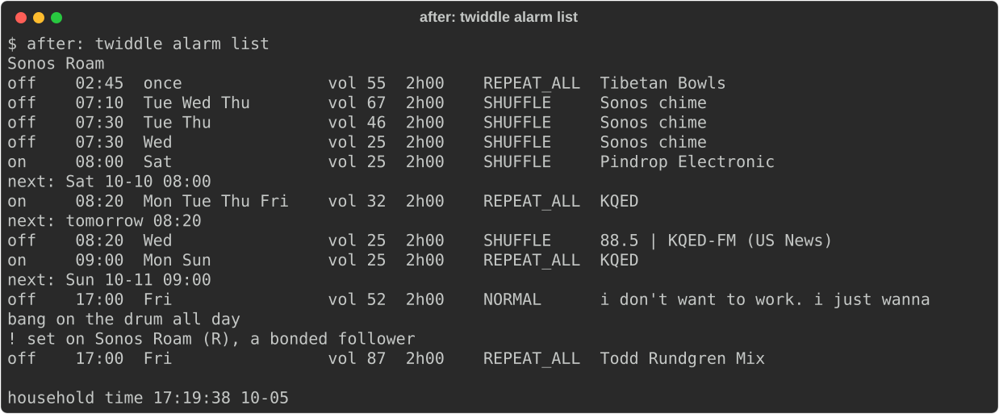
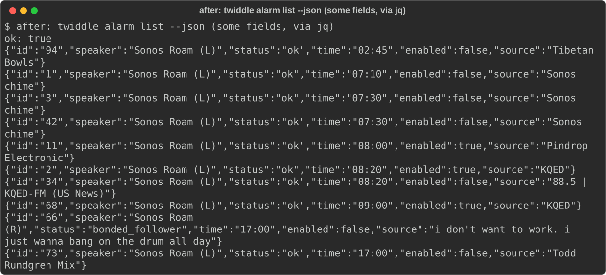
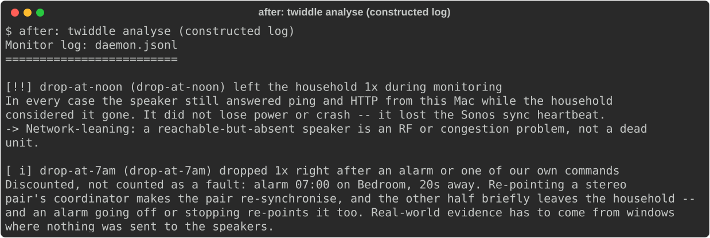

# #12 M1: See every alarm — demo write-up

Milestone M1 of epic #12 (Sonos Alarm Manager). The three slices were merged straight onto `main` before epic branches existed, so:

- **before** = `d1c5358b08^` (the commit before T1.1);
- **after** = `origin/main` at `8a6dec8`.

The before and after pictures were taken from detached worktrees at those commits, one right after the other, on 2026-10-05 around 17:19 PDT.

## What was built

| Slice | What | PR |
|---|---|---|
| #28 T1.1 | `twiddle.alarms.model`: `Alarm` parses a ListAlarms `<Alarm>` and serialises back to the exact CreateAlarm/UpdateAlarm arguments (program URI/metadata opaque, unknown attributes and children kept). `Recurrence` handles ONCE/DAILY/WEEKDAYS/WEEKENDS/ON_<days>. Tests run against an anonymised recording of the household's ListAlarms. | #55 |
| #29 T1.2 | `alarms/clock.py` (AlarmClock reads: ListAlarms, GetTimeNow, GetFormat) and `twiddle alarm list` / `--json`. Each alarm is shown under its room name. A bonded follower, a vanished speaker, or an unknown UUID is labelled rather than hidden. The command reads only. | #57 |
| #30 T2 | The monitor logs an `alarm_schedule` record whenever the alarm list version or the household's UTC offset changes. `analyse` treats a vanish within 45s of an enabled alarm's fire or stop time as induced, using the schedule in force at that time. | #59 |

## Steps as run

Every step was read-only. There were no speaker writes, so nobody had to run or confirm anything.

1. **`twiddle alarm list`.** At `before`, argparse rejects `alarm` (picture 1). At `after`, it lists the household's 10 alarms under Sonos Roam (picture 2). Alarm 66, set on the right Roam (the bonded follower), is shown with "! set on Sonos Roam (R), a bonded follower".
2. **`twiddle alarm list --json`,** piped through `jq` to keep a few fields per alarm (picture 3). The full rows also carry `room_uuid` and `program_uri` (Spotify playlist ids, account serials); they were left out of a public picture on purpose. Alarm 66 has `"status": "bonded_follower"`.
3. **`analyse` and alarm fires.**
   - The live daemon (`logs/daemon.jsonl`, recording since 2026-10-03 18:05 PDT, now run from twiddle) has logged 3 `alarm_schedule` records. That resolves T2's note that the daemon had to be reinstalled from twiddle.
   - None of its 18 vanishes is near an enabled alarm. The closest is about 286 minutes from any fire or stop, checked by a script over the schedule and the vanishes. So running `analyse` on the real log looks the same before and after.
   - To show the behaviour, a **constructed** log was used, built with the same record shapes as `tests/test_report.py`. It contains one schedule (a weekday 07:00 one-hour alarm in "Bedroom", UTC-7), one vanish 20s after the Monday 07:00 fire (`drop-at-7am`), and one at 12:12 (`drop-at-noon`).
   - At `before`, both are faults (picture 4). The old code ignores the unknown `alarm_schedule` record without error. At `after`, `drop-at-7am` is "dropped 1x right after an alarm … alarm 07:00 on Bedroom, 20s away", and `drop-at-noon` is still a fault (picture 5).

## Pictures

1. 
2. 
3. 
4. 
5. 

## What changed from the plan

- **GetTimeNow instead of GetTimeZone** (T1.2, T2). GetTimeZone returns an opaque index plus a DST flag. `CurrentLocalTime − CurrentUTCTime` is the offset the household actually uses, and an offset change logs a new schedule record, so DST is handled.
- **Polled, logged on change** (T2). There is no AlarmClock GENA subscription, so the monitor reads ListAlarms each sample and logs only when the version or offset changes. AlarmClock errors are swallowed and never count against the anchor.
- **Household-wide windows** (T2). Alarm windows discount vanishes on every speaker, the same way journalled writes do, not just the alarm's room and its bonded or grouped speakers.
- **Render fix** (T2). "(we were in the audio path)" is now chosen by the span's label.

## Known gaps

- Older logs carry no schedule, so alarm fires in them still count as faults.
- #79 (tech debt, filed from this demo): a single unparseable `<Alarm>` makes `parse_alarms` raise for the whole list, which empties `alarm list` and silently stops schedule logging.
- Whether UpdateAlarm keeps an alarm's `<Content>` (T1.1's note) is a question for M2, where alarms are first written.
