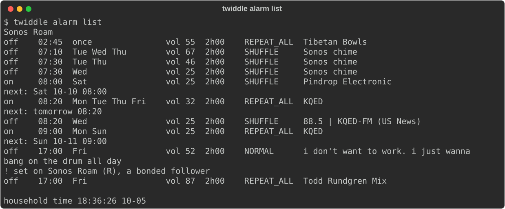
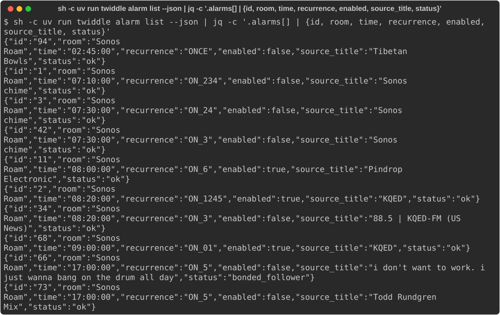
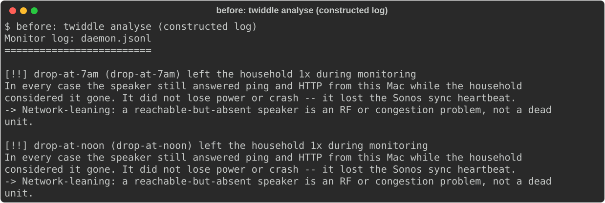

# #12 M1: See every alarm — demo write-up, rev 2

Rev 1 of this demo got `/changes` (a "sound source" field, and a reference for the JSON fields). Those changes were
planned as new slices **in M2**, not M1: **F1 #83** (`alarm list` shows each alarm's sound source) and
**F2 #84** (a field reference for `alarm list --json`). Alarms through the relay are a new issue, **#81**.

Why not in M1: M1 was built straight onto `main`, before epic branches. `epic/12` already carries M2's first four
slices, so a fix slice in M1 would make M1's demo show M2's unapproved write commands, and M1 couldn't ship until M2
was accepted (#82). M2's planned source registry (#35) is where the sound-source field naturally belongs.

So **M1's code is the same as in rev 1.** This revision asks whether M1, as it is, is accepted.

- **before** = `d1c5358b08^` (the commit before T1.1);
- **after** = `origin/main` at `8a6dec8`, the same commit rev 1 was taken from (`main` hasn't moved since).

## What was built

| Slice | What | PR |
|---|---|---|
| #28 T1.1 | `Alarm` model and `Recurrence`, round-tripping every ListAlarms field; tested against an anonymised recording of the household. | #55 |
| #29 T1.2 | `twiddle alarm list` / `--json`: every alarm under its room's name, bonded follower / vanished / unknown rooms labelled, next fire in the household's own clock. Read-only. | #57 |
| #30 T2 | The daemon logs the alarm schedule when it changes; `analyse` treats a drop within 45s of an enabled alarm's fire or stop as induced. | #59 |

## Steps as run (2026-10-05, about 18:36 PDT)

All read-only. No speaker or alarm was written, so nothing needed a person to run it.

1. **`twiddle alarm list`** at `after`, freshly captured (picture 1): 10 alarms under Sonos Roam, 3 on; alarm 66 is
   flagged "set on Sonos Roam (R), a bonded follower".
2. **`twiddle alarm list --json`** through `jq`, keeping a few fields per alarm (picture 2). Alarm 66 is
   `"status": "bonded_follower"`. `room_uuid` and `program_uri` were left out of the public picture on purpose.
3. **`analyse` and alarm fires** (pictures 3 and 4): **the same pictures as rev 1**, since the code is unchanged.
   They use a constructed log (one weekday 07:00 alarm in "Bedroom", a drop 20s after it fired, a drop at noon),
   because no real drop has happened near one of the household's alarms. Before: both drops are faults. After: the
   7am drop is discounted ("alarm 07:00 on Bedroom, 20s away"); the noon drop still counts.

## Pictures

1. 
2. 
3. 
4. 

## What changed from the plan

Nothing since rev 1. Rev 1's notes stand: the household's offset comes from GetTimeNow (local − UTC), not the opaque
time-zone index; the daemon polls ListAlarms each sample and logs on change; alarm windows discount drops household-wide.

## Known gaps

- The sound-source column and the field reference are **not built yet**: F1 #83 and F2 #84, in M2.
- Older logs carry no schedule, so alarm fires in them still count as faults.
- #79 (tech debt): one unparseable alarm empties `alarm list` and silently stops schedule logging.
- #82: the tooling gap that made the changes go to M2.
