# #47 demo: WFMU's artist and song, and other stations' titles

Shown on 2026-10-05, around 09:25–09:40 New York time. **Before** is `7b14781^`, just before the first slice merged. **After** is `main` at `621f509`. Each before/after pair was taken one right after the other, because live radio changes minute to minute.

Every step was read-only. Nothing played on a speaker. dial ran with `--dry-run --output mac`, and its saved state went into a scratch copy (`TWIDDLE_DIAL_CACHE`), so the user's own dial settings were never read or changed. No writes were needed, so nobody confirmed any.

## What was built

| Slice | What | PR |
|---|---|---|
| T1 (#50) | A station can name how its stream title is built (`fetch_args = { titles = "<shape>" }`). Internal: no station's output changes, so there is no picture | #56 |
| T2 (#51) | WFMU's `"Song" by Artist on Show on WFMU` title gives song, artist and show. A trailing `with "…"` credit is dropped when an artist is looked up | #60 |
| T3 (#53) | WFMU's song, show, host, album and the show's playlist so far come from wfmu.org's live page and playlist, instead of the RSS of the last *published* playlist | #62 |
| T4 (#52) | Title shapes for comedy247 (iHeart `text="…"`), koreancitypop (`Artist · Song (year)`) and kcrw (`Show-Host-join.kcrw.com`) | #63 |
| T5 (#54) | `stations probe` recognises a known title shape and drafts `titles = "<shape>"`, and the add-radio-station skill gains a capture → shape → test step | #65 |

## The steps, as run

### 1. `np wfmu -i`: WFMU names the artist, the song, the album and the right show

| Before | After |
|---|---|
| 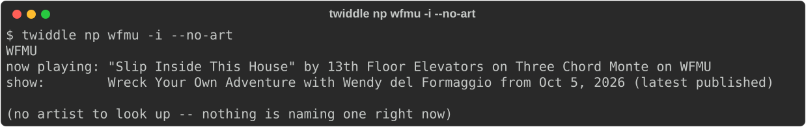 | 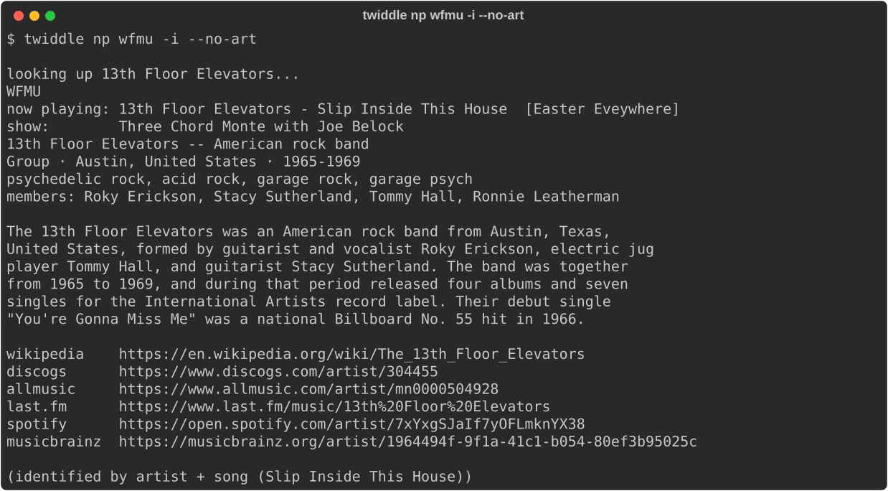 |

- **Before:** the whole stream title is shown as one string. The show line is a different show from earlier today, marked `(latest published)`. There is no artist to look up.
- **After:** `13th Floor Elevators - Slip Inside This House [Easter Eveywhere]`. The show is `Three Chord Monte with Joe Belock`, the one actually on air. The About-the-artist lookup finds the band. "Eveywhere" is how the DJ typed it in WFMU's playlist.

### 2. `dial` on WFMU

| Before | After |
|---|---|
| 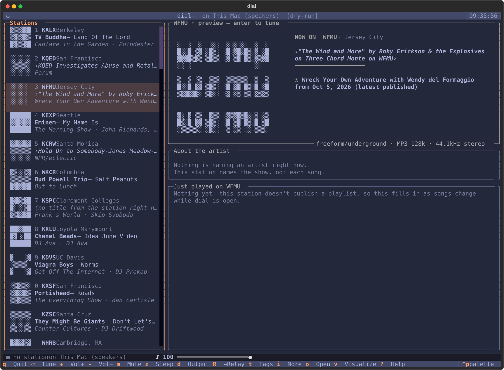 | 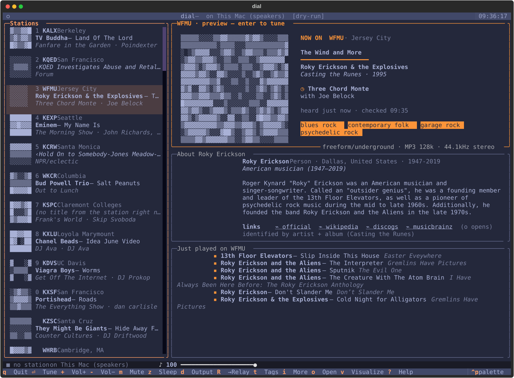 |

- **Before:** the title is shown raw. The show is the stale RSS one. About the artist says "Nothing is naming an artist". Just played is empty: "this station doesn't publish a playlist".
- **After:** the song `The Wind and More`, the artist `Roky Erickson & the Explosives`, the album and year (`Casting the Runes · 1995`), the show and host (`Three Chord Monte with Joe Belock`), genre tags, and About Roky Erickson. Just played lists the show's playlist with albums, starting a few seconds after dial opened.

The shot after pressing `i` (More) was the same screen with the artist's picture drawn, so it was left out.

### 3. `np comedy247`: the comedian and the bit

| Before | After |
|---|---|
| 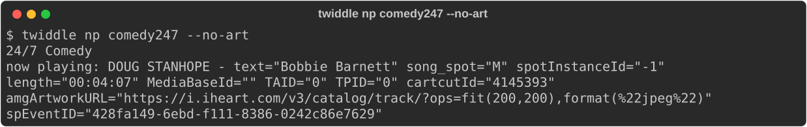 | 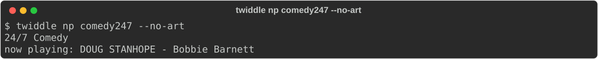 |

- **Before:** `DOUG STANHOPE - text="Bobbie Barnett" song_spot="M" …`, with the whole iHeart attribute blob as the song.
- **After:** `DOUG STANHOPE - Bobbie Barnett`.

### 4. `np koreancitypop`: artist and song, not a raw title

| Before | After |
|---|---|
| 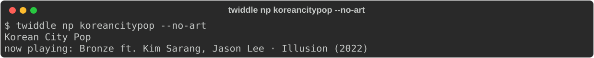 | 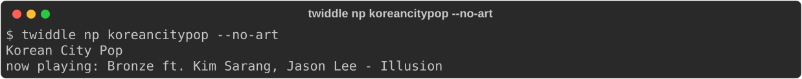 |

- **Before:** `Bronze ft. Kim Sarang, Jason Lee · Illusion (2022)` is shown raw. The station was `music = false`, so nothing knew the artist, and nothing could look it up.
- **After:** `Bronze ft. Kim Sarang, Jason Lee - Illusion`, with the artist and the song as separate fields and the year dropped.

### 5. `np kcrw`: not shown

KCRW was in a music show for the whole demo (`Tell Me When You're Home-Sycco-Tell Me When You're Home`). Music-show titles are deliberately left raw, so before and after were identical. The new show/host reading (`Good Food-Evan Kleiman-join.kcrw.com` → show `Good Food`, host `Evan Kleiman`) only appears during talk shows. It is proven by the offline tests (`test_kcrw_titles`), not by this demo.

### 6. `stations probe http://stream0.wfmu.org/freeform-128k`

| Before | After |
|---|---|
| 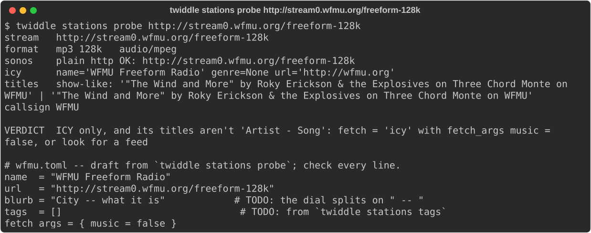 | 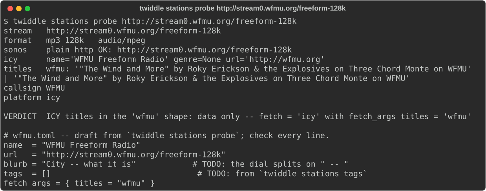 |

- **Before:** `show-like`, so the draft suggests `music = false`, which would have hidden every artist.
- **After:** `ICY titles in the 'wfmu' shape`, and the draft says `fetch_args = { titles = "wfmu" }`.

The first attempt ran while the DJ was talking, so both titles were `Your DJ speaks on Three Chord Monte on WFMU`. With no title naming an artist, the probe rightly would not call it `wfmu`. It was retaken during a song.

## What changed from the plan

- Songs a WFMU DJ has entered in the playlist *ahead of* the one on air are left out of Just played, because they haven't played yet. The plan didn't ask for this.
- comedy247 no longer splits a plain `Artist - Song` title: it reads only the iHeart `text="…"` form, so the attribute blob can never become the song again.
- A WFMU show line like `Marty McSorley's show` gives the show but no host. Guessing one would print "Marty McSorley's show with Marty McSorley".
- The diagnosis said KCRW was marked `music = false`. It wasn't. "Never an artist" for KCRW's show titles is new behaviour.

## Known gaps

The tech debt below, and a little more, is collected in #71.

- **While a WFMU DJ is talking, dial and `np` lose the show, the host and Just played.** Found during this demo. wfmu.org's live page then says `Your DJ speaks` with no song, and `parse_current_live_shows` returns nothing whenever there is no song (`fetchers/wfmu.py`: `if not out.get("song"): return {}`). Twiddle falls back to the stream title, which names no show it can use. Before T3 the RSS still named a (stale) show. Everything comes back when the next song starts. Filed as #70. Taken at 09:28 with the DJ talking:

  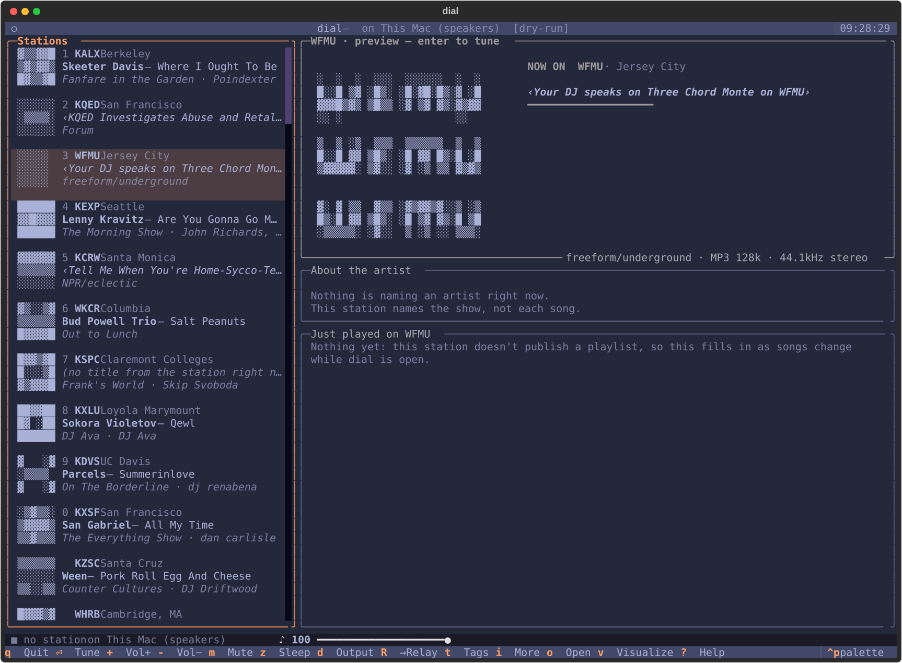

- KCRW music-show titles (`Song-Artist-Album`, bare hyphens) stay raw.
- If one poll mid-song falls back to the stream title, dial can briefly treat the same song as a new one (`raw_title` differs between the two paths).
- `stations probe` would also call another station's `"Song" by Artist on Show` titles `wfmu`, even without `on WFMU`.
- T1 is internal and has no picture of its own. T2–T5 are what it made possible.

## Try it yourself (read-only)

    uv run twiddle np wfmu -i
    uv run twiddle np comedy247
    uv run twiddle np koreancitypop
    uv run twiddle np kcrw
    uv run twiddle stations probe http://stream0.wfmu.org/freeform-128k
    uv run twiddle dial --dry-run
